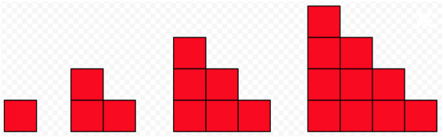

## Gaussian Addition (aka Sum of Integers)

1. Introduce the connection between images and algebra using the border problem from [youcubed’s](https://www.youcubed.org/algebra/) algebra course.
    - [Border Problem](https://www.youcubed.org/wp-content/uploads/2018/09/Border-Problem-final-copy.pdf)
2. Use Fawn’s excellent site [Visual Patterns](https://www.visualpatterns.org). I tend to start with linear patterns at first (e.g., #11, #17, and #24) and slowly introduce higher degree patterns depending on the sophistication of the class (e.g., #16, #5). Once the class has a good grasp I share the infamous #22:  

3. Laugh evilly Offer support as students struggle. This may be a good time to bust out some blocks and let kids build different figures (you know like when we can see kids in person again). I have found that this pattern really leads kids to want to define their expressions recursively even though we have been dealing only with explicit expressions. They will say things like “for any figure, you just need to add the next number!”. 
4. Run with these student ideas! But make it clear that if you need figure 100, for example. That means you need figure 99. Which means you need figure 98. Which means… Well, you get it. Computers are great at stuff like this. So suggest using python.
    - [Sample code using Colab](https://colab.research.google.com/drive/1zTEoLdDxaCJG3Dhj9Qn7EGxE4WPKqRkW?usp=sharing)
    - [Sample code using trinket](https://trinket.io/python/564712f6a5)
5. Now that we have an awesome recursive method, let’s explore the explicit. Kalid Azad from [betterexplained.com](https://betterexplained.com/) has a fantastic article on this. In the past, I have turned this article into a mini-lecture that includes the story of when Gauss was a child and his teacher asked the kids to add up all the numbers from 1 to 100 so he could nap. Hence the name, Gaussian addition. Kids are usually amazed to see the connections between $\1+2+3+4+5+…+n = \frac{n(n+1)}{2}$ and the original pattern. I usually end by introducing sigma notation just for fun. 
Techniques for Adding the Numbers 1 to 100

