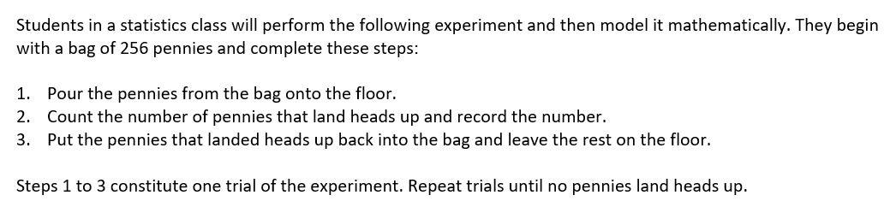

## Exponential Decay

The inspiration for this activity came from browsing twitter. [@BridgetDunbar](https://twitter.com/BridgetDunbar/status/1367171395440943106?s=20) asked, "Is there a simulator out there for flipping a lot of coins at once?" I didn't know of any that would give the count of all the heads and tails, so I coded a simple one for her. 

```python
import random

FLIPS = 200
heads = 0
tails = 0
for flip in range(FLIPS):
  flip = random.randint(0, 1)
  if flip == 0:
    heads += 1
  else:
    tails += 1
    
print("Number of heads: " + str(heads))
print("Number of tails: " + str(tails))
```

After a couple clarifying questions turns out she was trying to recreate this statistics activity.


No worries, python can handle that easily! So I created a program in google colab that allows mimics the experiment. Then she asked for the ability to see the outcomes of multiple experiments. I added a second cell where the user can enter the number of times they would like to run the experiment it will construct a graph for each one. By letting python handle the calculations and graphing you can free up your mind for more interesting questions like, why does it make sense that this represents exponential decay? If you start with 256 coins, how many trials do you expect there to be in each experiment?

  - [Modeling Exponential Decay with Coin Flips](https://colab.research.google.com/drive/1flh0juoKmo9I8bb67Ant3PMHhoF-958l?usp=sharing)

