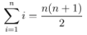

## Gaussian Addition (aka Sum of Integers)

Introduce the connection between images and algebra using the [border problem](https://www.youcubed.org/wp-content/uploads/2018/09/Border-Problem-final-copy.pdf) from [youcubed’s](https://www.youcubed.org/algebra/) algebra course. Then use Fawn Nguyen’s excellent site [Visual Patterns](https://www.visualpatterns.org). I tend to start with linear patterns at first (e.g., #11, #17, and #24) and over a couple of weeks I slowly introduce higher degree patterns depending on the sophistication of the class (e.g., #16, #5). Once the class has a good grasp I share the infamous #22:


~~Laugh evilly~~ Offer support (but not too much) as students struggle. This may be a good time to bust out some blocks and let kids build different figures. I have found that this pattern really leads kids to want to define their expressions recursively even though we have been dealing only with explicit expressions. They will say things like “for any figure, you just need to add the next number!” Run with these student ideas! But make it clear that if you need figure 100, for example, that means you need figure 99. But in order to get figure 99, you need figure 98. But in order to get figure 98, you need figure 97. But in order... Well, you get it. Computers are great at stuff like this. So suggest using python.

This function below starts with the variable total set to zero. Then for each figure starting from zero to figure_number it sets total to its current value plus the figure number. This has the effect of adding consecutive integers.

```python
def gauss_add(figure_number):
    total = 0
    for num in range (int(figure_number)+1):
        total = total + num
    print (f'The sum of integers from 0 to {figure_number} is {total}.')
```
So if you want to know the sum of integers up to 100, call the function with 100 as the argument like this: `guass_add(100)`. The output of the program will be "The sum of integers from 1 to 100 is 5050."

- [Sample code using Colab](guassian_addition.ipynb)
- [Sample code using trinket](https://trinket.io/python/564712f6a5)
 
Now that we have an awesome recursive method, let’s explore the explicit. Kalid Azad from [betterexplained.com](https://betterexplained.com/) has a fantastic article on this: [Techniques for Adding the Numbers 1 to 100](https://betterexplained.com/articles/techniques-for-adding-the-numbers-1-to-100/). In the past, I have turned this article into a mini-lecture that includes the story of when Gauss was a child and his teacher asked the kids to add up all the numbers from 1 to 100 so he could nap. Hence, the name, Gaussian addition. Kids are usually amazed to see the connections between the formula, and the original pattern. I usually end by introducing sigma notation just for fun and maybe blow some 8th grade minds. 

 - 
