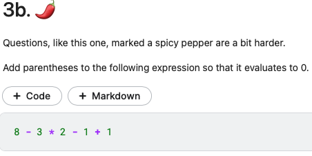

# Order of Operations

Found yet another gem from [Kaggle](https://www.kaggle.com). I recently stumbled across their python course for beginners. I decided to check it out. That's when I saw this beauty of an exercise.\ 
\
It was so simple yet so beautiful at the same time. So I plan to put together a google collab notebook of similar problems for students to explore.

- [Order of Operations 1](https://colab.research.google.com/drive/1SMZZER6MUNb_GNOE0YDuwJfH3Kh-VWi2?usp=sharing)
