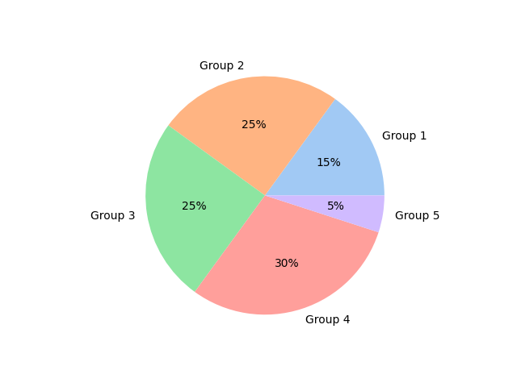

# Simple Pie Chart

[Mike Driscoll](https://twitter.com/driscollis/status/1503509558353924101/photo/1) is a machine and just keeps sharing great ideas. This tweet was about creating a simple pie chart in python. No pandas, just matplotlib and seaborn for the color palette.

# Sample Code

- [Python Script](../coding-activities/simple_pie_chart.py)
- [Google Colab](https://colab.research.google.com/drive/1Rt3c9ePgCUD0sq7Uyqw4Pk4qjOpyeMOE)

## Sample chart

